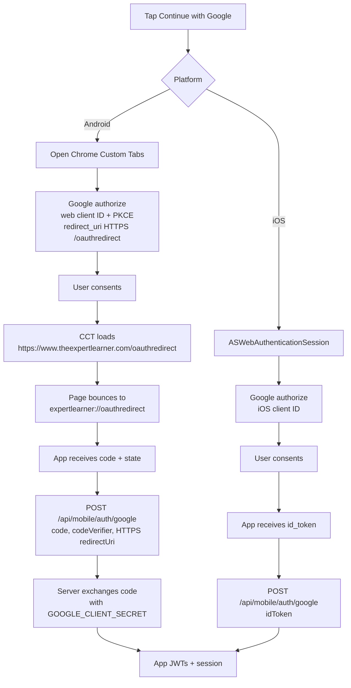
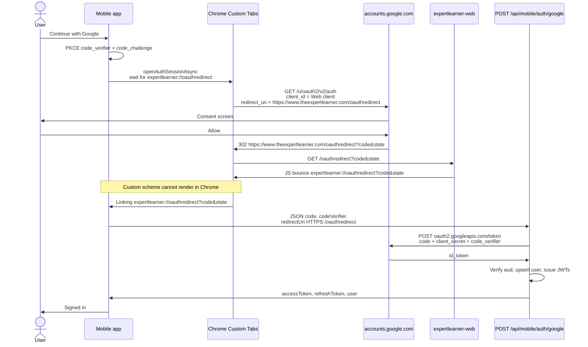
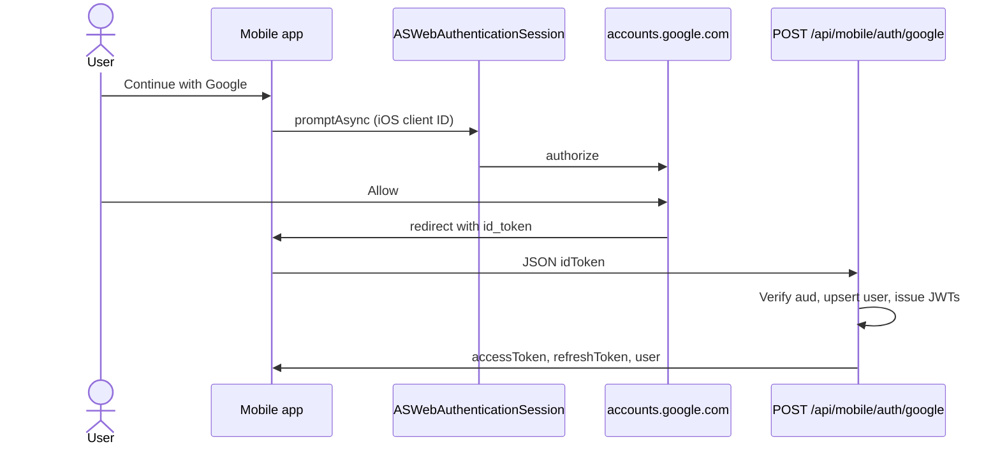

# Mobile Google OAuth

Android Google sign-in uses a **Web** OAuth client, an HTTPS App Link, then a custom-scheme bounce back into the app. The client secret never ships in the APK.

iOS still uses an iOS OAuth client and a custom scheme (not wired until `googleIosClientId` is a real ID).

Canonical Cloud Console steps also live in [`../expertlearner-web/OAUTH_README.md`](../expertlearner-web/OAUTH_README.md).

## Process overview



Chrome Custom Tabs treat the HTTPS App Link as a normal webpage, so Android **must** bounce to `expertlearner://oauthredirect`. Google still only sees the HTTPS `redirect_uri`.

## Android sequence



## iOS sequence (when iOS client is configured)



Until `extra.googleIosClientId` and server `GOOGLE_IOS_CLIENT_ID` are set, iOS Google sign-in will not complete.

## Environment configuration

Same **Web** client ID in three places: Google Cloud, Vercel / web `.env`, and mobile `app.json`. The **secret** is web/server only.

### Google Cloud Console (Web application client)

Authorized redirect URIs:

| Redirect URI | Role |
|--------------|------|
| `https://www.theexpertlearner.com/oauthredirect` | Mobile Android (Google returns `code` here) |
| `https://www.theexpertlearner.com/api/auth/callback/google` | Admin NextAuth |

Do not register `expertlearner://…` on the Web client. That scheme is only the in-app bounce after Google has already redirected to HTTPS.

### `expertlearner-web` (`.env` and Vercel)

```bash
# Web OAuth client (admin NextAuth + Android App Links)
GOOGLE_CLIENT_ID="YOUR_WEB_CLIENT_ID.apps.googleusercontent.com"
GOOGLE_CLIENT_SECRET="GOCSPX-…"

# Must match Google's authorized redirect URI and mobile googleOAuthRedirectUrl
GOOGLE_OAUTH_REDIRECT_URI="https://www.theexpertlearner.com/oauthredirect"

# Optional ID-token audiences (no secrets)
GOOGLE_ANDROID_CLIENT_ID="YOUR_ANDROID_CLIENT_ID.apps.googleusercontent.com"
GOOGLE_IOS_CLIENT_ID="YOUR_IOS_CLIENT_ID.apps.googleusercontent.com"

# Digital Asset Links for HTTPS /oauthredirect
ANDROID_APP_PACKAGE="com.expertlearner.app"
ANDROID_ASSETLINKS_SHA256="AA:BB:CC:…"
```

`AUTH_SECRET` / `AUTH_URL` are NextAuth session settings, not Google.

After changing Vercel env, redeploy the web app so `/oauthredirect` and `/.well-known/assetlinks.json` pick up the values.

### `expertlearner-mobile` (`app.json` / `app_preview.json` / `app_local.json`)

Public IDs only. Never put `GOOGLE_CLIENT_SECRET` here.

```json
{
  "expo": {
    "scheme": "expertlearner",
    "android": {
      "package": "com.expertlearner.app",
      "intentFilters": [
        {
          "action": "VIEW",
          "autoVerify": true,
          "data": [
            {
              "scheme": "https",
              "host": "www.theexpertlearner.com",
              "pathPrefix": "/oauthredirect"
            }
          ],
          "category": ["BROWSABLE", "DEFAULT"]
        }
      ]
    },
    "extra": {
      "googleWebClientId": "<same as GOOGLE_CLIENT_ID>",
      "googleIosClientId": "<iOS OAuth client ID>",
      "googleAndroidClientId": "<Android OAuth client ID>",
      "googleOAuthRedirectUrl": "https://www.theexpertlearner.com/oauthredirect"
    }
  }
}
```

Optional Expo env overrides (same meaning as `extra`):

| Env | Maps to |
|-----|---------|
| `EXPO_PUBLIC_GOOGLE_WEB_CLIENT_ID` | `extra.googleWebClientId` |
| `EXPO_PUBLIC_GOOGLE_IOS_CLIENT_ID` | `extra.googleIosClientId` |
| `EXPO_PUBLIC_GOOGLE_ANDROID_CLIENT_ID` | `extra.googleAndroidClientId` |
| `EXPO_PUBLIC_GOOGLE_OAUTH_REDIRECT_URL` | `extra.googleOAuthRedirectUrl` |

| Value | Web | Mobile |
|-------|-----|--------|
| Web client ID | `GOOGLE_CLIENT_ID` | `extra.googleWebClientId` |
| Web client secret | `GOOGLE_CLIENT_SECRET` | **do not set** |
| HTTPS redirect | `GOOGLE_OAUTH_REDIRECT_URI` | `extra.googleOAuthRedirectUrl` |
| Native bounce | `/oauthredirect` script | `getGoogleNativeReturnUri()` → `expertlearner://oauthredirect` |
| Android package | `ANDROID_APP_PACKAGE` | `android.package` |
| Signing SHA-256 | `ANDROID_ASSETLINKS_SHA256` | Play / EAS credentials (not in app.json) |

`android.intentFilters` is native config: rebuild the Android binary after changing it. The `/oauthredirect` bounce page is website JS: redeploy web. Waiting for `expertlearner://` is mobile JS: reload or EAS Update.

## Code map

| Piece | Location |
|-------|----------|
| Start Google + CCT wait | `src/auth/use-google-auth.ts` |
| Client IDs / URIs | `src/config/api.ts` |
| Session after code or id_token | `src/auth/AuthProvider.tsx` |
| Code exchange + ID token verify | `expertlearner-web/src/lib/mobile-auth/google-oauth.ts` |
| Mobile API | `expertlearner-web/src/app/api/mobile/auth/google/route.ts` |
| HTTPS bounce page | `expertlearner-web/src/app/oauthredirect/page.tsx` |
| Digital Asset Links | `expertlearner-web/src/app/.well-known/assetlinks.json/route.ts` |
